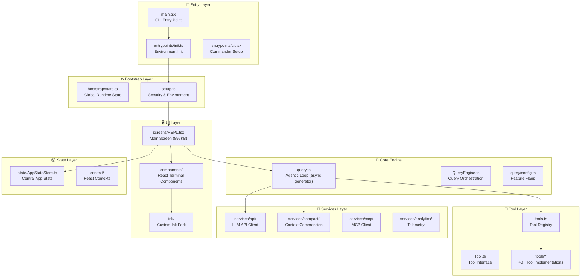

# 🏗️ Architecture Overview — my-code Code Engine

> **Codebase:** `C:\Users\RengarajKamatchinath\Downloads\my code beta\src`  
> **Identity:** An agentic AI coding assistant CLI (internal codename: "tengu")  
> **Stack:** TypeScript, React/Ink (terminal UI), Bun bundler, Commander.js CLI

---

## What This System Is

This is a **local CLI application** that acts as an autonomous AI coding agent. It can:
- Read, edit, and create files on your filesystem
- Execute shell commands in sandboxed environments
- Spawn parallel sub-agents for complex multi-step tasks
- Connect to IDEs (VSCode, JetBrains) via WebSocket bridge
- Use external tools via Model Context Protocol (MCP)
- Persist sessions and resume conversations

---

## High-Level Architecture



---

## Directory Map

| Directory | Files | Purpose |
|---|---|---|
| `bootstrap/` | 1 | Global runtime state (session ID, CWD, model, costs, telemetry) |
| `entrypoints/` | 6 | Startup initialization, CLI routing, SDK types |
| `bridge/` | 32 | WebSocket bridge connecting CLI ↔ IDE (VSCode/JetBrains) |
| `buddy/` | 6 | Companion sprite/notification system |
| `cli/` | 8 | Headless/print mode, structured output, NDJSON streaming |
| `commands/` | 102 | All `/slash` commands (87 dirs + 15 files) |
| `components/` | ~80 | React terminal UI components (dialogs, messages, diffs) |
| `constants/` | 22 | System prompt (54KB), tool limits, OAuth config |
| `context/` | 9 | React contexts (notifications, modals, stats, voice) |
| `coordinator/` | 1 | Multi-agent coordinator mode |
| `hooks/` | 85 | 83 React hooks + 2 subdirectories |
| `ink/` | 48 | Custom fork of Ink (React-to-terminal renderer) |
| `keybindings/` | 14 | Customizable keyboard shortcut system |
| `memdir/` | 8 | Structured memory storage and retrieval |
| `native-ts/` | 3 | Native modules (color-diff, file-index, yoga-layout) |
| `outputStyles/` | 1 | Custom output formatting styles |
| `plugins/` | 2 | Plugin system (builtin + bundled) |
| `query/` | 5 | Query loop config, deps, stop hooks, token budget |
| `remote/` | 4 | Remote session management, WebSocket, SDK adapter |
| `schemas/` | 1 | Hook validation schemas |
| `screens/` | 3 | Main screens: REPL, Doctor, ResumeConversation |
| `server/` | 4 | Direct connect session server |
| `services/` | ~40 | API client, compaction, MCP, analytics, OAuth, voice |
| `shims/` | 3 | Build-time shims (bun:bundle, macros) |
| `skills/` | ~10 | Bundled & dynamic skill loading |
| `state/` | 6 | Central AppState store, selectors, reactions |
| `tasks/` | 9 | Background task types (Dream, LocalAgent, Remote, Shell) |
| `tools/` | ~60 | 40+ tool implementations (Bash, Edit, Read, Agent, etc.) |
| `types/` | 12 | Core type definitions (message, command, hooks, permissions) |
| `upstreamproxy/` | 2 | CONNECT relay for enterprise proxy support |
| `utils/` | 329 | Massive utility library (git, sandbox, config, session, etc.) |
| `vim/` | 5 | Vim emulation for the text input |
| `voice/` | 1 | Voice mode feature flag |

---

## The Execution Flow

### 1. Startup Sequence
```
main.tsx → parse CLI args → determine client type (cli/sdk/vscode/remote)
         → eagerLoadSettings() → run() → Commander.js program
         → preAction hook: init() → enableConfigs → setupGracefulShutdown
         → setup() → trust dialog → showSetupScreens
         → Ink render(REPL.tsx)
```

### 2. User Sends a Prompt
```
REPL.tsx → handlePromptSubmit() → enqueue UserMessage
         → QueryEngine starts queryLoop()
         → Gather context: claudemd, memory, attachments
         → Compress if needed (snip/microcompact/collapse)
         → API call to LLM (streaming)
```

### 3. LLM Responds with Tool Calls
```
queryLoop() → parse streaming response
            → detect tool_use blocks
            → StreamingToolExecutor routes to tool implementation
            → Tool.call() executes (e.g., BashTool runs command)
            → Result fed back to LLM as tool_result
            → Loop continues until no more tool calls
```

### 4. Context Management
```
Token count approaching limit?
  → Snip: Remove irrelevant history entries
  → Microcompact: Compress tool outputs in-place
  → Context Collapse: Collapse read/search tool groups
  → Autocompact: Full summarization of older messages
```

---

## Key Files (By Importance)

| File | Size | Role |
|---|---|---|
| `screens/REPL.tsx` | 895KB | The main interactive screen — orchestrates everything |
| `main.tsx` | 804KB | CLI entry point with all Commander.js options |
| `utils/messages.ts` | 193KB | Message normalization for API calls |
| `utils/sessionStorage.ts` | 180KB | Session persistence and resume |
| `utils/hooks.ts` | 159KB | Hook system (PreToolUse, PostToolUse, etc.) |
| `utils/attachments.ts` | 127KB | Context injection (memory, files, docs) |
| `bridge/bridgeMain.ts` | 115KB | IDE bridge core logic |
| `bridge/replBridge.ts` | 100KB | REPL ↔ IDE WebSocket bridge |
| `hooks/useTypeahead.tsx` | 212KB | Autocomplete/typeahead system |
| `hooks/useReplBridge.tsx` | 115KB | Bridge hook |
| `cli/print.ts` | 212KB | Headless `-p` print mode |
| `utils/teleport.tsx` | 175KB | Session teleport between environments |
| `bootstrap/state.ts` | 56KB | All global runtime state variables |
| `constants/prompts.ts` | 54KB | The LLM system prompt |
| `query.ts` | ~60KB | The core agentic loop |
| `Tool.ts` | 29KB | Tool interface definition |
| `tools.ts` | 17KB | Tool registry |
| `commands.ts` | 25KB | Command registry |
