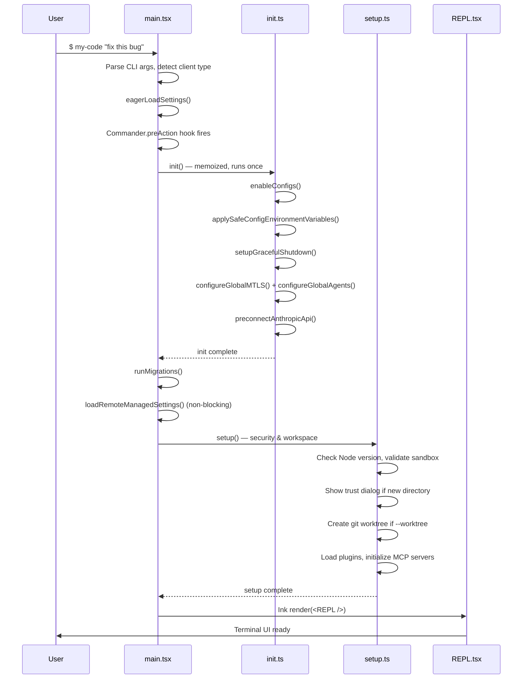

# 🚀 Bootstrap & Lifecycle

> How the application starts, initializes state, and shuts down.

---

## 3-Stage Startup Pipeline



---

## Stage 1: `main.tsx` — CLI Entry Point

**File:** `src/main.tsx` (4685 lines, 804KB)

### What It Does
1. **Detects client type** from `process.env.CLAUDE_CODE_ENTRYPOINT`:
   - `cli` — Standard terminal usage
   - `my-code-vscode` — VSCode extension
   - `sdk-typescript` / `sdk-python` / `sdk-cli` — SDK consumers
   - `my-code-desktop` — Desktop app
   - `remote` — Remote session (CCR)
   - `local-agent` — Internal agent

2. **Parses 50+ CLI options** via Commander.js:
   - `--print` / `-p` — Non-interactive mode
   - `--model` — Override model selection
   - `--dangerously-skip-permissions` — Bypass security
   - `--mcp-config` — Load MCP servers
   - `--system-prompt` — Custom system prompt
   - `--worktree` — Git worktree isolation
   - `--bare` — Minimal mode (skip hooks, plugins, CLAUDE.md)

3. **Processes tools, permissions, and MCP** before handing off to `setup()`

### Key Functions
| Function | Purpose |
|---|---|
| `main()` | Top-level entry — sets env vars, detects mode |
| `run()` | Creates Commander program, defines all options |
| `getInputPrompt()` | Reads piped stdin for `-p` mode |

---

## Stage 2: `entrypoints/init.ts` — Environment Initialization

**File:** `src/entrypoints/init.ts` (342 lines)

### What It Does (runs exactly once via `memoize`)
1. `enableConfigs()` — Validates and enables config system
2. `applySafeConfigEnvironmentVariables()` — Sets env vars from settings
3. `applyExtraCACertsFromConfig()` — TLS cert setup
4. `setupGracefulShutdown()` — Registers cleanup handlers
5. `initialize1PEventLogging()` — OpenTelemetry event logging (async)
6. `populateOAuthAccountInfoIfNeeded()` — OAuth cache
7. `initJetBrainsDetection()` — IDE detection (async)
8. `detectCurrentRepository()` — Git repository detection (async)
9. `configureGlobalMTLS()` — Mutual TLS settings
10. `configureGlobalAgents()` — HTTP proxy configuration
11. `preconnectAnthropicApi()` — TCP+TLS handshake overlap
12. `setShellIfWindows()` — Git Bash detection on Windows

---

## Stage 3: `bootstrap/state.ts` — Global Runtime State

**File:** `src/bootstrap/state.ts` (1761 lines, 56KB)

This is the **single source of truth** for all runtime state. It uses a module-level `STATE` object (not React state) accessed via getter/setter functions.

### Key State Variables

| Category | Variables |
|---|---|
| **Identity** | `sessionId`, `originalCwd`, `projectRoot`, `cwd`, `clientType` |
| **Cost Tracking** | `totalCostUSD`, `totalAPIDuration`, `modelUsage{}` |
| **Code Metrics** | `totalLinesAdded`, `totalLinesRemoved` |
| **Model** | `mainLoopModelOverride`, `initialMainLoopModel`, `modelStrings` |
| **Session** | `isInteractive`, `kairosActive`, `sessionSource` |
| **Telemetry** | `meter`, `sessionCounter`, `costCounter`, `tokenCounter` |
| **Security** | `sessionBypassPermissionsMode`, `sessionTrustAccepted` |
| **Agent** | `agentColorMap`, `agentColorIndex`, `sessionCreatedTeams` |
| **Cache** | `systemPromptSectionCache`, `promptCache1hAllowlist` |
| **Persistence** | `sessionPersistenceDisabled`, `sessionProjectDir` |

### Important Design Decisions

> [!WARNING]
> The file has prominent comments: **"DO NOT ADD MORE STATE HERE"** and **"THINK THRICE BEFORE MODIFYING"**. This is the DAG leaf — it must not import from other modules to avoid circular dependencies.

---

## Shutdown & Cleanup

**File:** `src/utils/gracefulShutdown.ts` (20KB)

### Cleanup Registry Pattern
```
registerCleanup(fn) → adds fn to cleanup queue
gracefulShutdown()  → runs all registered cleanups in order
```

### What Gets Cleaned Up
1. LSP server connections (`shutdownLspServerManager`)
2. Session teams created by sub-agents (`cleanupSessionTeams`)
3. Telemetry providers flushed
4. Session state persisted to disk
5. MCP server connections closed
6. Tmux panes terminated (for agent swarms)

---

## Configuration System

**File:** `src/utils/config.ts` (63KB)

### Config Hierarchy (highest priority wins)
```
1. CLI flags (--model, --permission-mode)
2. Environment variables (CLAUDE_CODE_*)
3. Flag settings (--settings file)
4. Policy settings (enterprise managed)
5. Local settings (.claude/settings.local.json)
6. Project settings (.claude/settings.json)
7. User settings (~/.claude/settings.json)
```

### Settings Sources
| Source | Path | Scope |
|---|---|---|
| `userSettings` | `~/.claude/settings.json` | All projects |
| `projectSettings` | `.claude/settings.json` | This project |
| `localSettings` | `.claude/settings.local.json` | This machine |
| `flagSettings` | `--settings` CLI file | This session |
| `policySettings` | Enterprise managed | Organization |
