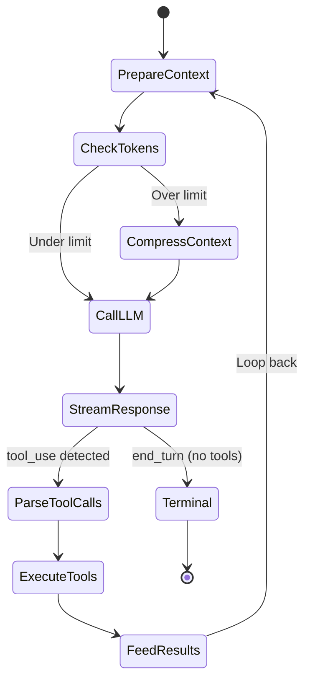
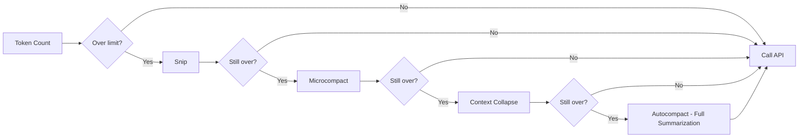

# 🧠 The Query Engine — The Brain

> The core agentic loop that drives all AI interactions.

---

## Overview

The query engine is the heart of the system. It is an **async generator function** (`queryLoop`) that:
1. Sends the conversation context to the LLM API
2. Streams the response in real-time
3. Detects and executes tool calls
4. Feeds tool results back to the LLM
5. Repeats until the LLM stops calling tools

---

## Core Files

| File | Size | Purpose |
|---|---|---|
| `query.ts` | ~60KB | The `queryLoop()` async generator — main loop |
| `QueryEngine.ts` | 46KB | Orchestration layer wrapping the generator |
| `query/config.ts` | 1.8KB | Feature flags for query behavior |
| `query/deps.ts` | 1.4KB | Dependency injection for testability |
| `query/stopHooks.ts` | 17KB | Logic for when to stop the loop |
| `query/tokenBudget.ts` | 2.3KB | Token budget tracking per turn |
| `query/transitions.ts` | 871B | State machine: `Terminal` vs `Continue` |

---

## The Query Loop — `query.ts`



### Step-by-Step Flow

#### 1. Prepare Context
```typescript
// Gather: system prompt + conversation history + attachments
const systemPrompt = await getSystemPrompt(tools, model, dirs, mcpClients)
const messages = normalizeMessagesForAPI(conversationMessages)
```

**Attachments injected here include:**
- CLAUDE.md content (project instructions)
- Memory files (persistent knowledge)
- MCP server instructions
- Skill discovery hints
- File state from recent edits

#### 2. Check Token Budget
The system tracks tokens across multiple dimensions:
- **Input tokens** — what we send to the API
- **Output tokens** — what the LLM generates
- **Cache read tokens** — prompt cache hits (cheaper)
- **Cache creation tokens** — new prompt cache entries

#### 3. Context Compression (4-Tier)

When the context approaches the model's limit, compression kicks in automatically:

| Tier | Strategy | When | What It Does |
|---|---|---|---|
| **Snip** | `collapseReadSearch.ts` | First resort | Collapse groups of read/search tool results into summaries |
| **Microcompact** | `services/compact/` | Second resort | Compress individual tool outputs inline |
| **Context Collapse** | `collapseBackgroundBashNotifications.ts` | Third resort | Collapse background notifications and teammate shutdowns |
| **Autocompact** | `services/compact/` | Last resort | Full summarization — replaces older messages with a summary |



#### 4. Call the LLM API
```typescript
// Streaming call to Anthropic Messages API
const stream = client.messages.stream({
  model,
  system: systemPromptBlocks,
  messages,
  tools: toolDefinitions,
  max_tokens,
  // ... beta headers, thinking config, etc.
})
```

#### 5. Parse Streaming Response
The response is parsed block-by-block as it streams:
- `text` blocks → rendered to the terminal as markdown
- `tool_use` blocks → routed to `StreamingToolExecutor`
- `thinking` blocks → stored but not shown (unless verbose)

#### 6. Execute Tools
```typescript
// StreamingToolExecutor manages concurrent tool execution
const executor = new StreamingToolExecutor(tools, context)
// Tools that are concurrency-safe run in parallel
// Tools that aren't run sequentially
const result = await tool.call(input, context, canUseTool, parentMessage)
```

#### 7. Feed Results Back
```typescript
// Tool results become tool_result messages
messages.push({
  role: 'user',
  content: [{ type: 'tool_result', tool_use_id, content: result }]
})
// Loop back to step 1
```

---

## Stop Hooks — `query/stopHooks.ts`

The loop decides to stop based on:

| Condition | Action |
|---|---|
| LLM sends `end_turn` with no tool calls | **Terminal** — task complete |
| Max turns reached (`--max-turns`) | Force stop |
| Max budget exceeded (`--max-budget-usd`) | Force stop |
| User cancels (Ctrl+C) | Abort |
| Token budget exhausted | Force stop with notification |
| Circuit breaker (repeated failures) | Force stop |

---

## Recovery Strategies

| Error | Recovery |
|---|---|
| `prompt_too_long` | Trigger autocompact, retry |
| `max_output_tokens` hit | Continue with partial result, feed back |
| Rate limit (429) | Exponential backoff with jitter |
| Network error | Retry with exponential backoff |
| Tool execution error | Return error as tool_result to LLM |

---

## Token Budget System

```typescript
// Per-turn tracking
snapshotOutputTokensForTurn(budget)  // Start of turn
getTurnOutputTokens()                 // Current turn usage
getCurrentTurnTokenBudget()           // Turn limit

// Session tracking  
getTotalInputTokens()                 // Lifetime input
getTotalOutputTokens()                // Lifetime output
getTotalCacheReadInputTokens()        // Cache hits
getTotalCostUSD()                     // Dollar cost
```

---

## Key Design Decisions

> [!NOTE]
> **Why an async generator?** The `queryLoop` is a `function*` that `yield`s state transitions. This allows the REPL to control when to advance the loop, pause for user input, or cancel mid-stream.

> [!IMPORTANT]
> **Tool result storage:** Large tool outputs (>threshold) are persisted to disk and replaced with a summary + file path. This prevents the context from being dominated by a single huge tool output (e.g., a 10,000-line `grep` result).

> [!WARNING]
> **Autocompact is destructive:** Once messages are summarized, the original content is lost from the conversation. The summary is generated by the LLM itself, so information can be lost. The system tracks `pendingPostCompaction` to log cache miss rates after compaction.
