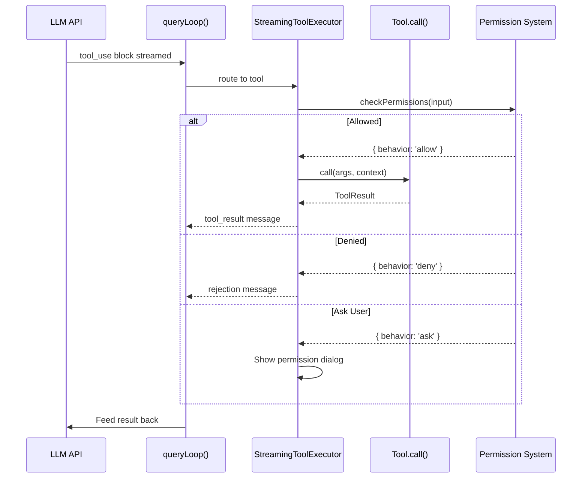

# 🔧 Tools Reference — The AI's Hands

> Every tool the LLM can invoke via function calling.

---

## The Tool Interface — `Tool.ts` (795 lines)

Every tool implements this interface:

```typescript
type Tool = {
  name: string                    // Unique tool name
  aliases?: string[]              // Backwards-compat names
  inputSchema: ZodSchema          // Zod validation schema
  maxResultSizeChars: number      // Max output before disk persistence
  
  // Core methods
  call(args, context, canUseTool, parentMessage, onProgress): Promise<ToolResult>
  prompt(options): Promise<string>         // LLM-facing description
  description(input, options): Promise<string>  // Human-facing description
  
  // Permission system
  checkPermissions(input, context): Promise<PermissionResult>
  validateInput?(input, context): Promise<ValidationResult>
  
  // Behavior flags
  isEnabled(): boolean
  isReadOnly(input): boolean
  isConcurrencySafe(input): boolean
  isDestructive?(input): boolean
  
  // UI rendering
  renderToolUseMessage(input, options): ReactNode
  renderToolResultMessage?(content, progress, options): ReactNode
  renderToolUseProgressMessage?(progress, options): ReactNode
  
  // Classification
  toAutoClassifierInput(input): unknown     // For security classifier
  isSearchOrReadCommand?(input): { isSearch, isRead, isList }
}
```

### `buildTool()` Pattern
All tools use `buildTool(def)` which provides safe defaults:
- `isEnabled` → `true`
- `isConcurrencySafe` → `false` (assume not safe)
- `isReadOnly` → `false` (assume writes)
- `checkPermissions` → `{ behavior: 'allow' }` (defer to general system)

---

## Tool Registry — `tools.ts` (391 lines)

### Always-Available Tools

| Tool | Directory | Read-Only | Concurrent-Safe |
|---|---|---|---|
| **BashTool** | `tools/BashTool/` | ❌ | ❌ |
| **FileReadTool** | `tools/FileReadTool/` | ✅ | ✅ |
| **FileEditTool** | `tools/FileEditTool/` | ❌ | ❌ |
| **FileWriteTool** | `tools/FileWriteTool/` | ❌ | ❌ |
| **GlobTool** | `tools/GlobTool/` | ✅ | ✅ |
| **GrepTool** | `tools/GrepTool/` | ✅ | ✅ |
| **AgentTool** | `tools/AgentTool/` | ✅ | ✅ |
| **WebFetchTool** | `tools/WebFetchTool/` | ✅ | ✅ |
| **WebSearchTool** | `tools/WebSearchTool/` | ✅ | ✅ |
| **SkillTool** | `tools/SkillTool/` | ✅ | ❌ |
| **TodoWriteTool** | `tools/TodoWriteTool/` | ❌ | ❌ |
| **NotebookEditTool** | `tools/NotebookEditTool/` | ❌ | ❌ |
| **AskUserQuestionTool** | `tools/AskUserQuestionTool/` | ✅ | ❌ |
| **ExitPlanModeTool** | `tools/ExitPlanModeTool/` | ❌ | ❌ |
| **EnterPlanModeTool** | `tools/EnterPlanModeTool/` | ❌ | ❌ |
| **TaskStopTool** | `tools/TaskStopTool/` | ❌ | ❌ |
| **TaskOutputTool** | `tools/TaskOutputTool/` | ✅ | ✅ |
| **BriefTool** | `tools/BriefTool/` | ❌ | ❌ |
| **SendMessageTool** | `tools/SendMessageTool/` | ❌ | ✅ |

### Feature-Gated Tools (loaded conditionally)

| Tool | Gate | Purpose |
|---|---|---|
| **PowerShellTool** | Windows only | Windows shell execution |
| **TaskCreateTool** | `isTodoV2Enabled()` | Create background tasks |
| **TaskGetTool** | `isTodoV2Enabled()` | Get task status |
| **TaskUpdateTool** | `isTodoV2Enabled()` | Update task progress |
| **TaskListTool** | `isTodoV2Enabled()` | List all tasks |
| **TeamCreateTool** | `isAgentSwarmsEnabled()` | Create agent teams |
| **TeamDeleteTool** | `isAgentSwarmsEnabled()` | Delete agent teams |
| **EnterWorktreeTool** | `isWorktreeModeEnabled()` | Enter git worktree |
| **ExitWorktreeTool** | `isWorktreeModeEnabled()` | Exit git worktree |
| **REPLTool** | ant-only | REPL execution |
| **SleepTool** | `feature('PROACTIVE')` | Pause execution |
| **CronCreateTool** | `feature('AGENT_TRIGGERS')` | Schedule recurring tasks |
| **ToolSearchTool** | `isToolSearchEnabledOptimistic()` | Search available tools |
| **LSPTool** | `ENABLE_LSP_TOOL` env | Language Server queries |
| **WebBrowserTool** | `feature('WEB_BROWSER_TOOL')` | Browser automation |
| **SnipTool** | `feature('HISTORY_SNIP')` | Manual context snipping |
| **ConfigTool** | ant-only | Read/write configuration |
| **WorkflowTool** | `feature('WORKFLOW_SCRIPTS')` | Run workflow scripts |

### MCP Tools (Dynamic)
MCP tools are loaded at runtime from MCP server connections. They follow the same `Tool` interface but have `isMcp: true` and `mcpInfo: { serverName, toolName }`.

---

## Tool Categories Deep Dive

### 🖥️ Shell Execution
- **BashTool**: Runs shell commands. Uses sandbox when available. Supports timeout, working directory, and background execution.
- **PowerShellTool**: Windows-specific. Uses `powershell.exe` for native Windows operations.

### 📁 File Operations
- **FileReadTool**: Reads files with line-range support. Has `maxResultSizeChars: Infinity` (never persisted to disk).
- **FileEditTool**: Applies precise search-and-replace edits. Shows diffs in the UI.
- **FileWriteTool**: Creates new files. Validates paths against permission context.

### 🔍 Search & Discovery
- **GlobTool**: Find files by pattern (wraps filesystem glob).
- **GrepTool**: Regex search across files (wraps ripgrep).
- **ToolSearchTool**: Search available tools by keyword (for deferred tool loading).

### 🤖 Agentic
- **AgentTool**: Spawns sub-agents with isolated contexts. Supports named agent types, parallel execution, and fork subagents.
- **SendMessageTool**: Inter-agent messaging.
- **TeamCreateTool/TeamDeleteTool**: Manage agent swarm teams.

### 🌐 Web
- **WebSearchTool**: Internet search.
- **WebFetchTool**: Fetch and parse web pages.
- **WebBrowserTool**: Full browser automation (feature-gated).

### 📋 Task Management
- **TaskCreateTool**: Create background tasks with descriptions.
- **TaskGetTool/TaskListTool**: Query task state.
- **TaskUpdateTool**: Update progress.
- **TaskStopTool**: Stop running tasks.
- **TodoWriteTool**: Simple to-do list management.

### 📐 Planning
- **EnterPlanModeTool**: Switch to plan-only mode (no execution).
- **ExitPlanModeTool**: Exit plan mode and begin execution.

---

## How Tools Connect to the Query Loop



---

## Tool Permission Modes

| Mode | Behavior |
|---|---|
| `default` | Ask for dangerous operations |
| `auto` | Auto-approve (with classifier safety check) |
| `plan` | Read-only — no writes allowed |
| `bypassPermissions` | Skip all checks (sandbox only) |
