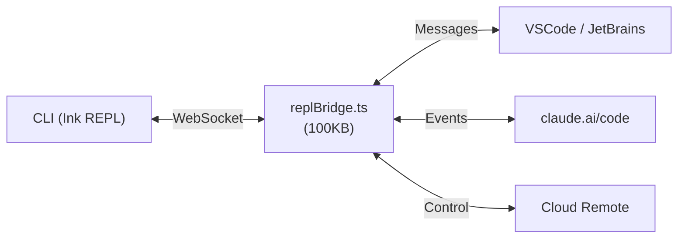
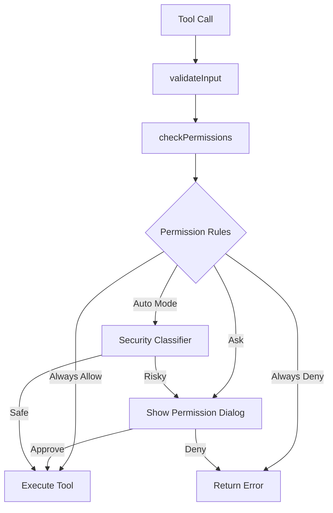

# 🔗 Bridge, Security, Memory, Hooks, Swarms & More

> Phases 9–15: Advanced systems covering the full codebase.

---

# Phase 9: Bridge & Remote

**Directory:** `src/bridge/` (32 files)

The bridge enables **bi-directional communication** between the CLI and external environments.

## Bridge Architecture


### Key Bridge Files
| File | Size | Purpose |
|---|---|---|
| `replBridge.ts` | 100KB | Core bridge state machine |
| `bridgeMain.ts` | 115KB | Main bridge logic and lifecycle |
| `bridgeApi.ts` | 18KB | API surface exposed to IDE |
| `bridgeMessaging.ts` | 15KB | Message serialization protocol |
| `bridgeUI.ts` | 16KB | UI event forwarding |
| `createSession.ts` | 12KB | Bridge session creation |
| `remoteBridgeCore.ts` | 39KB | Remote bridge for cloud sessions |
| `initReplBridge.ts` | 23KB | Bridge initialization |
| `jwtUtils.ts` | 9KB | JWT auth for bridge sessions |
| `trustedDevice.ts` | 7KB | Device trust management |

### Teleport System
**File:** `src/utils/teleport.tsx` (175KB!)

Teleport moves entire sessions between environments:
- Local CLI → Cloud remote
- Cloud remote → Local CLI
- Machine A → Machine B (via SSH)

### Remote Session Manager
```
src/remote/
├── RemoteSessionManager.ts  # Manage remote sessions
├── SessionsWebSocket.ts     # WebSocket event streaming
├── remotePermissionBridge.ts # Permission forwarding
└── sdkMessageAdapter.ts     # SDK message translation
```

---

# Phase 10: Permissions & Security

## Permission Modes

| Mode | Behavior | Use Case |
|---|---|---|
| `default` | Ask user for dangerous ops | Normal usage |
| `auto` | Auto-approve with classifier | Hands-off mode |
| `plan` | Read-only, no writes | Planning phase |
| `bypassPermissions` | Skip all checks | Sandboxed environments |

## Permission Flow


## Key Security Files
| File | Size | Purpose |
|---|---|---|
| `hooks/useCanUseTool.tsx` | 40KB | Runtime permission checks |
| `utils/auth.ts` | 65KB | OAuth, API keys, subscriptions |
| `utils/permissions/` | directory | Permission modes, rules, setup |
| `utils/sandbox/` | directory | Process sandboxing for Bash |
| `components/TrustDialog/` | directory | First-run trust prompt |

## The Trust Dialog
On first launch in a new directory:
1. Show warning about the project
2. User must explicitly trust the directory
3. Trust is persisted to disk (except home directory)
4. Without trust: write/edit tools disabled, CLAUDE.md not loaded

---

# Phase 11: Memory, Skills & Plugins

## CLAUDE.md — Project Instructions
**File:** `utils/claudemd.ts` (46KB)

Loaded from multiple locations (merged in priority order):
```
~/.claude/CLAUDE.md                    # User-wide
.claude/CLAUDE.md                      # Project root
.claude/CLAUDE.local.md                # Local (gitignored)
subdirectory/CLAUDE.md                 # Per-directory
```

## Memory System — `src/memdir/`
| File | Purpose |
|---|---|
| `memdir.ts` (21KB) | Core memory read/write |
| `memoryTypes.ts` (22KB) | Memory type definitions |
| `findRelevantMemories.ts` | Context-based memory retrieval |
| `paths.ts` | Memory file path resolution |
| `teamMemPaths.ts` | Team-shared memory paths |

## Attachments — `utils/attachments.ts` (127KB!)
Injects context into every query:
- CLAUDE.md content
- Memory files
- MCP server instructions  
- Skill discovery hints
- Git diff context
- File state from recent edits

## Skills System
```
src/skills/
├── bundledSkills.ts        # Skills shipped with the app
├── loadSkillsDir.ts        # Load from .claude/commands/
└── bundled/                # Bundled skill implementations
```

Skills are markdown files with optional YAML frontmatter:
```yaml
---
description: Generate a commit message
whenToUse: When the user wants to commit
---
Review the staged changes and generate a commit message...
```

## Plugin System
```
src/plugins/builtinPlugins.ts   # Built-in plugin registry
src/plugins/bundled/            # Bundled plugin implementations
src/services/plugins/           # Plugin lifecycle management
src/utils/plugins/              # Plugin loading utilities
```

Plugins can provide:
- New tools
- New slash commands
- New skills
- MCP server configurations

---

# Phase 12: Hooks & Utilities

## React Hooks — `src/hooks/` (83 files)

### Input & Interaction
| Hook | Size | Purpose |
|---|---|---|
| `useTypeahead.tsx` | 212KB | Autocomplete/command suggestion |
| `useVoiceIntegration.tsx` | 99KB | Voice input |
| `useTextInput.ts` | 17KB | Text input handling |
| `useVimInput.ts` | 9KB | Vim mode input |
| `useArrowKeyHistory.tsx` | 34KB | Command history navigation |
| `usePasteHandler.ts` | 10KB | Clipboard paste handling |

### Permissions & Tools
| Hook | Purpose |
|---|---|
| `useCanUseTool.tsx` (40KB) | Runtime tool permission checks |
| `useCancelRequest.ts` | Cancel in-flight requests |
| `useTurnDiffs.ts` | Track file changes per turn |

### IDE & Bridge
| Hook | Purpose |
|---|---|
| `useReplBridge.tsx` (115KB) | Bridge lifecycle management |
| `useIDEIntegration.tsx` | IDE connection |
| `useDirectConnect.ts` | Direct connect protocol |
| `useRemoteSession.ts` (23KB) | Remote session management |

### Background & Tasks
| Hook | Purpose |
|---|---|
| `useInboxPoller.ts` (34KB) | Poll for incoming messages |
| `useScheduledTasks.ts` | Cron task management |
| `useTasksV2.ts` | Task state management |
| `useSwarmInitialization.ts` | Agent swarm setup |

## System Hooks — `utils/hooks.ts` (159KB!)
Event-driven hooks that fire at lifecycle points:
- **SessionStart** — When a session begins
- **PreToolUse** — Before any tool executes
- **PostToolUse** — After any tool completes
- **FileChanged** — When a file is modified
- **Setup** — During initialization

## Key Utility Files

| File | Size | Purpose |
|---|---|---|
| `utils/sessionStorage.ts` | 180KB | Session persistence to disk |
| `utils/config.ts` | 63KB | Configuration management |
| `utils/hooks.ts` | 159KB | Hook execution system |
| `utils/attachments.ts` | 127KB | Context attachment system |
| `utils/auth.ts` | 65KB | Authentication |
| `utils/worktree.ts` | 50KB | Git worktree management |
| `utils/claudemd.ts` | 46KB | CLAUDE.md loading |
| `utils/ide.ts` | 46KB | IDE detection & connection |
| `utils/status.tsx` | 48KB | Status display system |
| `utils/git.ts` | 30KB | Git operations |
| `utils/commitAttribution.ts` | 29KB | Commit attribution |
| `utils/ripgrep.ts` | 21KB | Ripgrep wrapper |

## Keybindings — `src/keybindings/` (14 files)
Fully customizable keyboard shortcuts:
```
keybindings/
├── KeybindingContext.tsx      # React context provider
├── KeybindingProviderSetup.tsx # Setup and initialization
├── defaultBindings.ts         # Default key mappings
├── loadUserBindings.ts        # Load from settings
├── match.ts                   # Key sequence matching
├── parser.ts                  # Key notation parser
├── resolver.ts                # Binding resolution
└── schema.ts                  # Validation schema
```

## Vim Mode — `src/vim/` (5 files)
Full vim emulation for the input box:
- Normal mode, Insert mode, Visual mode
- Motions (w, b, e, 0, $, etc.)
- Operators (d, c, y, etc.)
- Text objects (iw, aw, i", a", etc.)

---

# Phase 13: Agent Swarms & Coordination

## Coordinator Mode
**File:** `src/coordinator/coordinatorMode.ts` (19KB)

Orchestrates multiple agents working in parallel on different aspects of a task.

## Task Types — `src/tasks/`
| Task Type | Purpose |
|---|---|
| `DreamTask` | Background exploration/research tasks |
| `InProcessTeammateTask` | In-process parallel agents |
| `LocalAgentTask` | Local shell-spawned agents |
| `LocalMainSessionTask` | Main session task tracking |
| `LocalShellTask` | Shell command tasks |
| `RemoteAgentTask` | Cloud-hosted agent tasks |

## Agent Swarm Files
| File | Purpose |
|---|---|
| `utils/teammate.ts` | Teammate identity and context |
| `utils/teammateMailbox.ts` (33KB) | Inter-agent messaging |
| `utils/swarm/` | Reconnection, prompts, snapshots |
| `utils/forkedAgent.ts` (24KB) | Fork sub-agent management |

## Buddy System — `src/buddy/`
| File | Purpose |
|---|---|
| `CompanionSprite.tsx` (45KB) | Animated companion in terminal |
| `companion.ts` | Companion state management |
| `sprites.ts` | ASCII sprite definitions |
| `useBuddyNotification.tsx` | Notification integration |

---

# Phase 14: CLI & Headless Mode

**Directory:** `src/cli/` (8 files)

| File | Size | Purpose |
|---|---|---|
| `print.ts` | 212KB | The `-p`/`--print` headless execution |
| `structuredIO.ts` | 28KB | JSON/NDJSON output for SDK consumers |
| `remoteIO.ts` | 9KB | I/O for remote-controlled sessions |
| `update.ts` | 14KB | Auto-update mechanism |
| `exit.ts` | 1.3KB | Clean exit codes |

### Print Mode (`--print`)
Runs headlessly without terminal UI:
- Accepts prompt from CLI args or stdin
- Outputs response to stdout
- Supports `--output-format text|json|stream-json`
- Supports `--input-format text|stream-json`
- Used by SDKs, CI/CD, and automation

---

# Phase 15: Types & Constants

## Core Types — `src/types/`
| File | Purpose |
|---|---|
| `message.ts` (11KB) | `UserMessage`, `AssistantMessage`, `ToolUseBlock`, `StreamEvent` |
| `command.ts` (7.7KB) | Slash command type definitions |
| `hooks.ts` (9.1KB) | Hook event types and callbacks |
| `permissions.ts` (13KB) | Permission schemas and rules |
| `plugin.ts` (11KB) | Plugin interface contracts |
| `ids.ts` (1.2KB) | Branded ID types (`SessionId`, `AgentId`) |
| `logs.ts` (11KB) | Log event type definitions |

## Constants — `src/constants/`
| File | Size | Purpose |
|---|---|---|
| `prompts.ts` | 54KB | The complete LLM system prompt |
| `outputStyles.ts` | 9.8KB | Output style configurations |
| `oauth.ts` | 9KB | OAuth provider configuration |
| `tools.ts` | 4.6KB | Tool name constants and deny lists |
| `toolLimits.ts` | 2.1KB | Max file sizes, output limits |
| `system.ts` | 3.8KB | System-level constants |
| `figures.ts` | 2KB | Unicode/ASCII figure characters |

### System Prompt Structure (`constants/prompts.ts`)
```
1. Identity section — "You are Claude Code..."
2. System section — Output formatting, permissions, hooks
3. Doing Tasks section — Code style, engineering practices
4. Actions section — Reversibility, blast radius awareness
5. Using Tools section — Tool preferences, parallelism
6. Tone & Style section — Emoji policy, formatting
7. Output Efficiency section — Conciseness rules
8. ═══ DYNAMIC BOUNDARY ═══ (cache breakpoint)
9. Session-specific guidance — Agent/skill/search guidance
10. Memory — Loaded from memdir
11. Environment — CWD, platform, model, shell info
12. MCP Instructions — From connected servers
13. Language — User's language preference
```

> [!IMPORTANT]
> Everything ABOVE the dynamic boundary is cached across users (global scope). Everything BELOW is session-specific and regenerated each turn.
