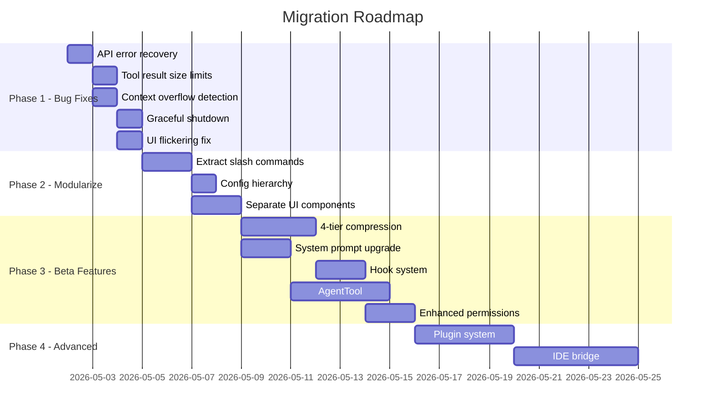

# 🔄 Migration Plan: Current → Beta

> Comparison of your current `my-code` CLI vs the beta reference, and a phased upgrade plan.

---

## Side-by-Side Comparison

### Scale Difference

| Metric | **Your Current** | **Beta Reference** | Gap |
|---|---|---|---|
| Total files | ~60 files | **550+ files** | 10x |
| CLI entry | `cli.ts` (518 lines) | `main.tsx` (4685 lines) | 9x |
| Query engine | `QueryEngine.ts` (614 lines) | `query.ts` + `QueryEngine.ts` (~2000 lines) | 3x |
| Tool interface | `Tool.ts` (160 lines) | `Tool.ts` (795 lines) | 5x |
| App state | `AppState.ts` (77 lines) | `AppStateStore.ts` (571 lines) | 7x |
| UI main screen | `App.tsx` (910 lines) | `REPL.tsx` (895KB / ~25K lines) | 27x |
| Tools count | 15 tools | **40+ tools** | 2.5x |
| Commands | 18 slash commands (hardcoded) | **87+ commands** (modular) | 5x |
| System prompt | `context.ts` (128 lines) | `prompts.ts` (916 lines) | 7x |
| Services | 0 (inline) | **18 services** | ∞ |
| Hooks (React) | 0 | **83 hooks** | ∞ |
| Bridge/IDE | None | **32-file bridge system** | ∞ |

---

## What's Broken / Missing in Your Current Build

### 🔴 Critical Issues (Causing Bugs)

| # | Issue | Where | Impact |
|---|---|---|---|
| 1 | **No error recovery on API failures** | `QueryEngine.ts:247` | Crashes on network errors, rate limits, prompt-too-long |
| 2 | **No streaming throttle for UI** | `App.tsx:248-254` | 33ms setTimeout is crude — causes flickering and ghost lines |
| 3 | **Tool results not size-bounded** | `Tool.ts` | Huge grep/read outputs blow up context, no disk persistence |
| 4 | **No context overflow detection** | `QueryEngine.ts` | Context silently overflows → API rejects → crash |
| 5 | **Slash commands hardcoded in App.tsx** | `App.tsx:312-663` | 350 lines of switch/case — unmaintainable, no extensibility |
| 6 | **Single-provider assumption** | `agent/providers/` | Provider switching is fragile, no graceful fallback |
| 7 | **No graceful shutdown** | Missing | MCP connections leak, transcripts not flushed on crash |

### 🟡 Missing Features (From Beta)

| # | Feature | Beta Location | Your Status |
|---|---|---|---|
| 1 | **4-tier context compression** | `services/compact/` | Only basic `compactMessages()` |
| 2 | **Agent/sub-agent spawning** | `tools/AgentTool/` | ❌ Missing |
| 3 | **Prompt cache optimization** | `constants/prompts.ts` (boundary marker) | ❌ Missing |
| 4 | **Trust dialog & security gates** | `components/TrustDialog/` | ❌ Missing |
| 5 | **Hook system (Pre/PostToolUse)** | `utils/hooks.ts` (159KB) | ❌ Missing |
| 6 | **Session persistence & resume** | `utils/sessionStorage.ts` (180KB) | Basic JSONL only |
| 7 | **CLAUDE.md / IG.md** multi-level loading | `utils/claudemd.ts` (46KB) | Basic 3-path only |
| 8 | **Plugin system** | `plugins/`, `services/plugins/` | ❌ Missing |
| 9 | **Skill system (custom commands)** | `skills/`, `tools/SkillTool/` | ❌ Missing |
| 10 | **IDE bridge (VSCode/JetBrains)** | `bridge/` (32 files) | Separate extension, not integrated |
| 11 | **File history & attribution** | `utils/fileHistory.ts`, `commitAttribution.ts` | ❌ Missing |
| 12 | **Keyboard customization** | `keybindings/` (14 files) | ❌ Missing |
| 13 | **Vim mode** | `vim/` (5 files) | ❌ Missing |
| 14 | **Permission rules (allow/deny patterns)** | `utils/permissions/` | Basic session/project only |
| 15 | **Web browser tool** | `tools/WebBrowserTool/` | ❌ Missing |
| 16 | **Background tasks** | `tasks/` (9 files) | ❌ Missing |
| 17 | **Agent swarms / teams** | `coordinator/`, `tools/Team*Tool/` | ❌ Missing |
| 18 | **Telemetry & analytics** | `services/analytics/` | ❌ Missing |
| 19 | **Remote sessions / teleport** | `remote/`, `utils/teleport.tsx` | ❌ Missing |
| 20 | **Speculation / prompt suggestion** | `AppStateStore.ts:386-398` | ❌ Missing |

---

## Migration Strategy

> [!IMPORTANT]
> **Do NOT try to port the beta 1:1.** The beta is a massive production system with 550+ files. Instead, we surgically adopt the **patterns and critical fixes** that solve your bugs and unlock key features.

### Phase 1: Fix Critical Bugs (Priority: NOW)
**Goal:** Stop the crashes and make what you have stable.

| Task | Files to Change | Effort |
|---|---|---|
| 1.1 Add API error recovery (retry, backoff, prompt-too-long) | `QueryEngine.ts` | 2-3 hrs |
| 1.2 Add tool result size limits + disk persistence | `Tool.ts`, each tool | 2 hrs |
| 1.3 Add context overflow detection + auto-compact trigger | `QueryEngine.ts`, `compact.ts` | 2 hrs |
| 1.4 Add graceful shutdown (cleanup registry) | New: `utils/cleanup.ts`, `cli.ts` | 1 hr |
| 1.5 Fix streaming UI flickering (requestAnimationFrame pattern) | `App.tsx` | 1 hr |

### Phase 2: Modularize Architecture (Priority: HIGH)
**Goal:** Break the monolith so features can be added without pain.

| Task | Files to Change | Effort |
|---|---|---|
| 2.1 Extract slash commands into `commands/` directory (1 file per command) | New: `commands/*.ts`, refactor `App.tsx` | 4-5 hrs |
| 2.2 Create proper event system (typed SessionEvents) | `agent/events.ts` | 2 hrs |
| 2.3 Add `buildTool()` default enrichment (match beta pattern) | `Tool.ts` | 1 hr |
| 2.4 Create proper config hierarchy (user → project → local → flags) | `config/globalConfig.ts` | 3 hrs |
| 2.5 Separate App.tsx into screen components (REPL, Status, Usage) | `ui/` directory | 3-4 hrs |

### Phase 3: Port Critical Beta Features (Priority: MEDIUM)
**Goal:** Bring in the features that make the biggest difference.

| Task | Source in Beta | Effort |
|---|---|---|
| 3.1 **4-tier context compression** (snip → microcompact → collapse → autocompact) | `services/compact/` | 6-8 hrs |
| 3.2 **System prompt upgrade** (sections, cache boundary, tool guidance) | `constants/prompts.ts` | 4 hrs |
| 3.3 **Hook system** (PreToolUse, PostToolUse) | `utils/hooks.ts` | 4-5 hrs |
| 3.4 **Trust dialog** (first-run security) | New component | 3 hrs |
| 3.5 **AgentTool** (sub-agent spawning) | `tools/AgentTool/` | 8-10 hrs |
| 3.6 **Enhanced permission rules** (pattern matching, always-allow/deny) | `utils/permissions/` | 4 hrs |
| 3.7 **Multi-level IG.md/CLAUDE.md loading** (per-directory, local, user) | `utils/claudemd.ts` | 2 hrs |
| 3.8 **Session storage upgrade** (full message persistence, proper resume) | `utils/sessionStorage.ts` | 4-5 hrs |

### Phase 4: Advanced Features (Priority: LOW — after stability)
**Goal:** Match beta capabilities for competitive parity.

| Task | Effort |
|---|---|
| 4.1 Plugin system | 8-10 hrs |
| 4.2 Skill system (custom slash commands from markdown) | 6-8 hrs |
| 4.3 IDE bridge integration (connect CLI ↔ VSCode extension) | 10-15 hrs |
| 4.4 Background tasks & task management | 6-8 hrs |
| 4.5 Keyboard customization (keybindings) | 4 hrs |
| 4.6 Vim mode | 4 hrs |
| 4.7 File history & undo/rewind | 6 hrs |
| 4.8 Remote sessions | 10+ hrs |

---

## Recommended Execution Order

---

## Files to NOT Touch (Keep As-Is)

These are **already good** in your current build:
- `agent/providers/` — Clean provider abstraction
- `tools/registry.ts` — Simple and works
- `session/pricing.ts` — Cost calculation is solid
- `session/stats.ts` — Adequate for now
- `ui/theme.ts` — Good color palette
- `utils/fileStateCache.ts` — Clean implementation
- `utils/zodToJsonSchema.ts` — Works correctly

---

## Quick Win: What to Do RIGHT NOW

Start with **Phase 1.1** — Add API error recovery to `QueryEngine.ts`. This is the single change that will make the biggest impact on stability. The beta has 3 recovery strategies:

1. **`prompt_too_long`** → trigger compact, retry
2. **Rate limit (429)** → exponential backoff with jitter
3. **Network error** → retry up to 3 times

Want me to start implementing Phase 1?
